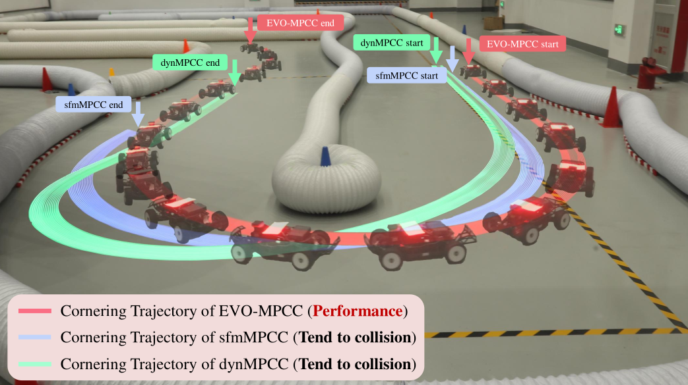
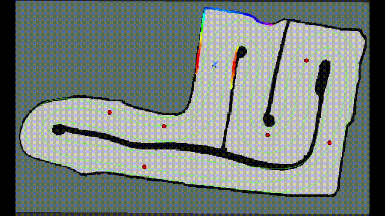

# 🏁 EVO-MPCC: Enhanced Velocity Optimization Model Predictive Contouring Control

<div align="center">
  
  
  <a href="https://ssrn.com/abstract=6127037">
    
  </a>
  <a href="https://ieeexplore.ieee.org/abstract/document/11128227">
    
  </a>
</div>


> **TL;DR**: EVO-MPCC is a real-time trajectory planning framework for autonomous racing that enables **high-speed cornering and overtaking** under limited prediction horizons.


This repository provides an implementation for deploying and visualizing EVO-MPCC from the paper "[EVO-MPCC: Enhanced Velocity Optimization with Learning-Based Auto-Tuning for Real-Time Vehicle Trajectory Planning](https://ssrn.com/abstract=6127037)", a framework that explicitly incorporates a reference velocity profile (RVP) into the MPCC objective. By performing continuous velocity optimization along the racetrack, EVO-MPCC enables feasible cornering and high-performance racing even under a limited prediction horizon. Based on the RVP, two complementary formulations are developed: EVO-RVT, which performs reference velocity tracking for high-performance racing in obstacle-free scenarios, and EVO-TVC, which introduces an RVP-based terminal velocity cost to enable flexible, collision-free, and time-efficient overtaking. The main branch contains both the simulator and the trajectory planner implementation.

<table>
  <tr>
    <td align="center" width="50%">
      
      <br/>
      <b>(a)</b> Cornering performance comparison.
    </td>
    <td align="center" width="50%">
      
      <br/>
      <b>(b)</b> Overtaking performance.
    </td>
  </tr>
</table>


## 🔄 From VPMPCC to EVO-MPCC

In my earlier work, the Velocity Prediction MPCC (VPMPCC) method was proposed, which corresponds to the EVO-RVT formulation and was presented in my ICRA2025 paper, “[A Data-Driven Aggressive Autonomous Racing Framework Utilizing Local Trajectory Planning with Velocity Prediction](https://arxiv.org/pdf/2410.11570).” Building upon VPMPCC, this repository further extends the framework to EVO-MPCC, enabling enhanced performance and overtaking capabilities.

<table>
  <tr>
    <td align="center" width="50%">
      
    </td>
    <td align="center" width="50%">
      
    </td>
  </tr>
</table>


## 🪄 Quickstart

This section provides a minimal setup to quickly run EVO-MPCC in simulation. The ROS environment for the current branch is Noetic under Ubuntu 20.04. Two methods are provided to configure the runtime environment:

1. Run directly using the pre-built Docker image.
2. Reconfigure from scratch using Docker.

Start by cloning this repository to the host:

```bash
git clone https://github.com/zhouhengli/EVO-MPCC.git f1tenth_ws
cd ./f1tenth_ws
```

## 🛠️ Configure

Either of the following two methods can be used to deploy the environment. 

### ✅ Run directly using the pre-built Docker image

Alternatively, the Docker configuration can be pulled from [Google Drive](https://drive.google.com/file/d/1pk2MK0nKocj3GiwBniOZNmhHBxJ0LjpT/view?usp=drive_link). Simply download it to your Linux system.


**[1/2]** Import the `prebuilt_v1.0.tar` file as a new image using Docker import:

```
docker import prebuilt_v1.0.tar prebuilt_v1.0
```

**[2/2]** Now, you can use the imported image to create and launch a new container:

```bash
docker run -it \
  --name evo-mpcc \
  -v /tmp/.X11-unix:/tmp/.X11-unix \
  -e DISPLAY=$DISPLAY \
  -v "$PWD":/home/ddrx/f1tenth_ws \
  -w /home/ddrx/f1tenth_ws \
  prebuilt_v1.0 \
  bash -c "source /home/ddrx/f1tenth_ws/toolkit/docker_start.sh && exec /bin/bash"
```
### ✅ [Optional] Reconfigure from scratch using Docker

**[1/3]** Pull Docker image:

```bash
docker pull ros:noetic-robot-focal
```

**[2/3]** Set up a container:

```bash
docker run -it \
  --name evo-mpcc \
  -v /tmp/.X11-unix:/tmp/.X11-unix \
  -e DISPLAY=$DISPLAY \
  -v "$PWD":/home/ddrx/f1tenth_ws \
  -w /home/ddrx/f1tenth_ws \
  ros:noetic-robot-focal \
  bash -c "source /home/ddrx/f1tenth_ws/toolkit/docker_start.sh && exec /bin/bash"
```

**[3/3]** Set up the necessary dependencies in the corresponding container using the bash script:

``` bash
chmod +x setup_env.sh
./setup_env.sh
```

### 🚀 Quick Planning Demo

**[1/3]** Set up a container and enter the following commands. After the final command, the map should pop up:

```bash
docker exec -it evo-mpcc /bin/bash
source /home/ddrx/f1tenth_ws/toolkit/docker_start.sh
./toolkit/sim_setup.sh -n mapwheV1
```

[Optional] If the RViz interface does not appear and there are error `qt.qpa.xcb: could not connect to display :0` or `qt.qpa.plugin: Could not load the Qt platform plugin "xcb" in "" even though it was found`, it may be because Docker does not have access to the display server.
Try the following command in the host machine: `xhost +local:docker`.

**[2/3]** Start a new container and run the EVO-MPCC planner:

```bash
docker exec -it evo-mpcc /bin/bash
source /home/ddrx/f1tenth_ws/toolkit/docker_start.sh
roslaunch nonlinear_mpc_casadi ddrx_nmpcc.launch
```

[Optional] For a real vehicle, change the param `is_sim = False` in `./params/ddrx_unified_params.yaml`.

**[3/3]** Use the '2D Nav Goal' as the starting signal for racing.

<div style="display: flex; justify-content: space-between; align-items: center;">
  
  
</div>

By modifying the configuration specified in `params/ddrx_unified_params.yaml`, different parameter sets can be selected. Among them, the `params/mpc/BO_params_icra.json` and `params/mpc/BO_params_LTM.json` configurations do not include overtaking behavior (as indicated by their JSON settings) and can be used for standard racing scenarios without overtaking.

To enable overtaking, please use `params/mpc/BO_params_OT.json`. In this case, obstacle positions are manually specified in
 `src/evo-mpcc_planner/src/nonlinear_mpc_casadi/scripts/Nonlinear_MPC_node.py`.


## 💻 Customization

This project allows for the customization of the map and track files used by the EVO-MPCC method, as well as the parameters. Adjustments can be made according to specific needs.

Before modifying them, replace the `home_dir` in `./params/ddrx_unified_params.yaml` with the path to the track files. 

### ✏️ Customized map and track

Maps files can be found in `toolkit/maps/`, and the map in this project is generated using Cartographer.

Track files are located in `toolkit/tracks/`, where path and boundaries are defined as a closed curve, and `<track_name>_center_derivates.csv` defines the deviations in the x and y directions. The third column is reference velocity profile (RVP), which is generated using [this method](https://github.com/ForzaETH/global_racetrajectory_optimization/tree/d49ac768e6bf39b57f9e9dd25d42f5075e1f8105).

### ✏️ Parameter Tuning

Parameter files are stored in `toolkit/params/`, and their definitions are consistent with those described in the corresponding papers. Specifically, the `BO_params_LTM.json` and `BO_params_OT.json` configurations follow the settings described in the EVO-MPCC paper, whereas `BO_params_icra.json` corresponds to the parameter settings presented in the ICRA 2025 paper. The primary difference among these configurations lies in the objective functions used during Bayesian Optimization.

## 🛠️ Issues and Fixes

### Missing `BO_params_icra.json` File

**Problem**:
When running the `planner_loader.py` script in the `nonlinear_mpc_casadi` package, you may encounter the following error:

`FileNotFoundError: [Errno 2] No such file or directory: '/home/ddrx/f1tenth_ws/params/mpc/BO_params_icra.json'`

**Solution**:
1. Open the `ddrx_unified_params.yaml` file located in the "params" directory.
2. Locate the following line:
	home_dir: "/home/ddrx"
	params_file: "BO_params_icra"
3. Change "ddrx" to your system's username (example "/home/ddrx" to "/home/usr")
4. Save the file.

## ⭐ Why Star This Repository?

- ✔️ State-of-the-art MPCC-based racing planner with overtaking capability
- ✔️ Fully reproducible simulation on F1TENTH
- ✔️ Open-source implementation accompanying peer-reviewed publications
- ✔️ Actively maintained and extensible for future research

Last but not least, a ⭐ would be greatly appreciated and would serve as strong encouragement for my continued open-source research efforts.

## 🤗 Acknowledgments

Many thanks to the excellent open-source repositories listed below:

- [Nonlinear_MPCC_for_autonomous_racing](https://github.com/nirajbasnet/Nonlinear_MPCC_for_autonomous_racing)
- [ForzaETH/race_stack](https://github.com/ForzaETH/race_stack)
- [Minimum Curvature Trajectory Planning](https://github.com/ForzaETH/global_racetrajectory_optimization/tree/d49ac768e6bf39b57f9e9dd25d42f5075e1f8105)
- [Cartographer](https://github.com/cartographer-project/cartographer)
- [CasADi](https://web.casadi.org/)

Please contact [Zhouheng Li](https://zhouhengli.github.io) if you have any questions or suggestions. If you encounter any issues or have questions during deployment, feel free to open an issue or submit a pull request—contributions and feedback are very welcome.

## 📑 Citations

If you find this project useful for your research, please consider citing the following papers and leaving a ⭐—both would be greatly appreciated :)

```
@article{Li2025EVOMPCC,
  title   = {EVO-MPCC: Enhanced Velocity Optimization with Learning-Based Auto-Tuning for Real-Time Vehicle Trajectory Planning},
  author  = {Li, Zhouheng and Zhou, Bei and Piccinini, Mattia and Hu, Cheng and Zarrouki, Baha and Mangharam, Rahul and Xie, Lei},
  year    = {2025},
  doi     = {10.2139/ssrn.6127037},
  url     = {https://ssrn.com/abstract=6127037},
}
```

```
@INPROCEEDINGS{11128227,
  author={Li, Zhouheng and Zhou, Bei and Hu, Cheng and Xie, Lei and Su, Hongye},
  booktitle={2025 IEEE International Conference on Robotics and Automation (ICRA)}, 
  title={A Data-Driven Aggressive Autonomous Racing Framework Utilizing Local Trajectory Planning with Velocity Prediction}, 
  year={2025},
  pages={16657-16663},
  doi={10.1109/ICRA55743.2025.11128227}
}
```

